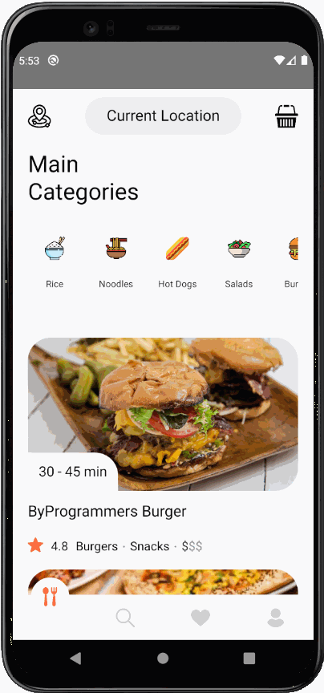

# Food delivery app 

Application created using React Native.



This application was created coding along with [ByProgrammers](https://www.byprogrammers.com/2020/12/lcrn-ep8-food-delivery-app/) and uses dummy data.

### How to run on Android simulator

* Clone the repository: ```git clone https://github.com/everton-araujo/food-delivery.git```;
</Br>
* On project folder, download the dependencies: ```yarn``` or ```npm install```;
</br>
* With the android simulator running. Run the application: ```yarn android```;

### TODO
* Refactor using styled components;
* Remove the dummy data and fetch an API;
* Create the order functionality;
* Include a map on order page;
* Convert to typescript;
